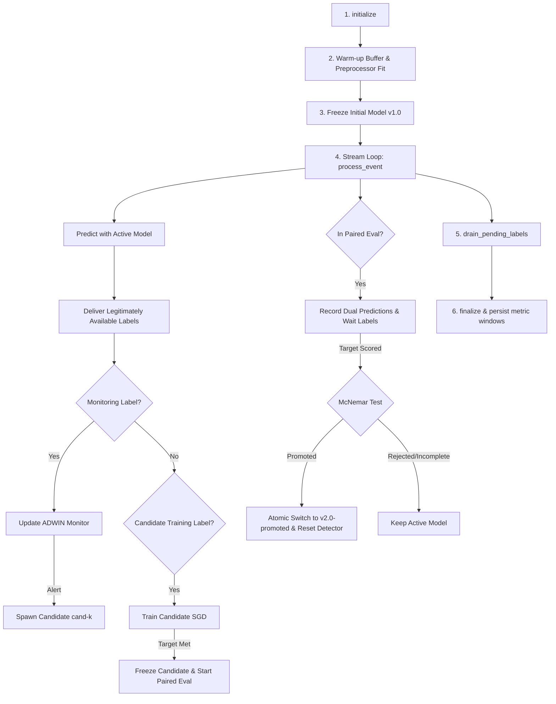
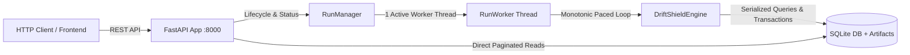
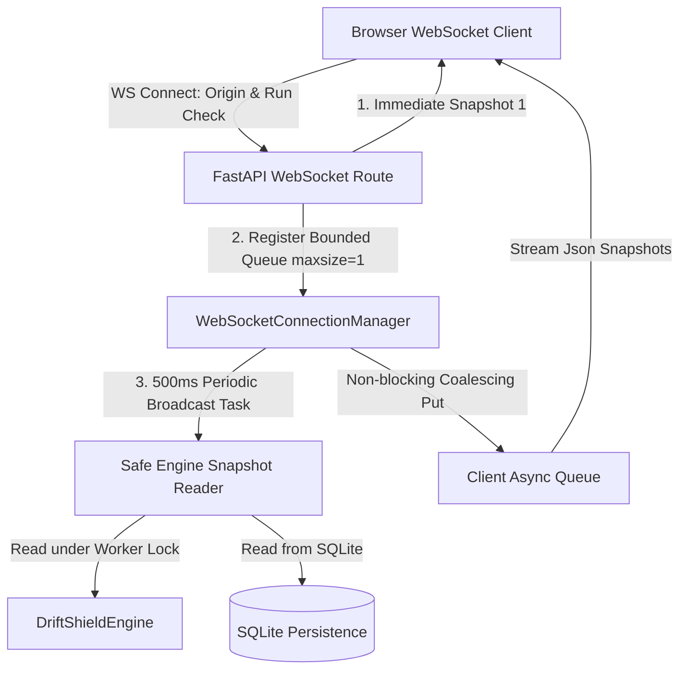

# DriftShield Phase 5A — Reusable Engine & SQLite Persistence

## 1. Overview & Architectural Goals

Phase 5A establishes the reusable execution core and durable persistence layer for DriftShield, unifying baseline streaming, warm-up, ADWIN error-change monitoring, candidate training, paired evaluation, and atomic model promotion under a single-owner state engine backed by SQLite.

### Key Principles
1. **Single-Owner Mutable State**: Run state is serialized and managed strictly by `DriftShieldEngine`. No concurrent mutable access to models or pipeline state occurs.
2. **Deterministic Reusable Engine**: `DriftShieldEngine` provides clear lifecycle methods: `initialize()`, `process_event()`, `drain_pending_labels()`, `finalize()`, `get_snapshot()`, and `export_artifacts()`.
3. **Durable SQLite Persistence**: Fully conforms to Section 10 of the Master Specification, implementing foreign keys, transactions, schema versioning, WAL journal mode, unique run/event constraints, and `parent_run_id` lineage.
4. **Content-Hashed Model Artifacts**: Model and preprocessor artifacts are stored with server-generated filenames and verified SHA-256 content hashes. When promotion replaces an active model, previous models and preprocessors remain preserved on disk and referenced in the database.
5. **Strict Truth Separation**: Simulator ground truth is recorded solely in the dedicated `evaluator_truth` table, inaccessible to learning, monitoring, or candidate modules.
6. **Robust Reliability & Deduplication**: Duplicate event IDs and labels are handled idempotently; conflicting duplicate data is rejected with explicit errors. Unfinished runs are marked `INTERRUPTED` on startup without claiming false checkpoint continuation.

---

## 2. Reusable Engine Architecture (`engine.py`)

The `DriftShieldEngine` encapsulates the entire single-run lifecycle:



### Engine Lifecycle Methods
- `initialize(stream_events, label_records)`: Fits scaler preprocessor on warm-up data, initializes `v1.0-frozen`, registers model version, evaluator truth, and run records in SQLite, and sets state to `WARMUP`.
- `process_event(event)`:
  - Validates duplicate and sequence monotonic constraints.
  - Scores prediction using the currently active frozen model version before revealing labels.
  - Records prediction into storage.
  - If in paired evaluation, also records candidate model prediction on identical features.
  - Delivers pending labels whose delivery sequence equals current sequence.
  - Records label acquisition requests with budget debits in `label_requests`.
  - Updates ADWIN monitoring loss and candidate training.
  - Updates incident lifecycle outcomes and evidence.
- `drain_pending_labels()`: Advances logical clock step-by-step past stream end to deliver delayed labels.
- `finalize()`: Marks candidate and run state `COMPLETED` (or `INTERRUPTED`), persists metric windows, and commits final run summary.
- `get_snapshot()`: Returns an immutable, serializable `EngineSnapshot` capturing active model version, candidate state, ADWIN estimation, buffer counts, and metric summaries.
- `export_artifacts()`: Exports standard CSV/JSON evidence files (`predictions.csv`, `alerts.csv`, `candidate_training.csv`, `candidate_summary.json`, `paired_evaluation.csv`, `paired_summary.json`, `metrics.json`).

---

## 3. SQLite Persistence Architecture (`storage.py`)

The `SQLiteStorage` manages persistence under SQLite 3 with `PRAGMA foreign_keys = ON` and `PRAGMA journal_mode = WAL`.

### Schema Structure (Master Specification Section 10)
| Table Name | Primary Key | Key Relationships / Constraints | Purpose |
| :--- | :--- | :--- | :--- |
| `schema_migrations` | `version` | None | Tracks schema migration version (`v1.0`). |
| `runs` | `run_id` | `parent_run_id REFERENCES runs(run_id)` | Run configuration, seed, mode, environment, status, and replay lineage. |
| `events` | `(run_id, event_id)` | `UNIQUE(run_id, sequence)` | Ingested feature events, timestamps, and synthetic flags. |
| `predictions` | `prediction_id` | `FK(run_id, event_id)` | Model predictions, predicted probabilities, and active version tag. |
| `labels` | `label_id` | `UNIQUE(run_id, event_id, channel)` | Delivered ground-truth labels, acquisition channels, and delays. |
| `label_requests` | `request_id` | `FK(run_id, event_id)` | Label acquisition requests, channels, costs, and budget debits. |
| `incidents` | `incident_id` | `FK(run_id)` | ADWIN drift alerts, detection delays, full evidence lifecycle, and decisions. |
| `model_versions` | `model_version_id` | `FK(run_id)` | Model lineage, activation sequence, artifact paths, and SHA-256 hashes. |
| `metric_windows` | `window_id` | `FK(run_id)` | Evaluation/monitoring windows, denominators, sample counts, and error rates. |
| `benchmarks` | `benchmark_id` | `FK(run_id)` | *Schema ready; deferred until multi-scenario benchmark orchestration suite.* |
| `evaluator_truth` | `(run_id, event_id)` | `FK(run_id)` | Hidden simulator ground truth for independent evaluation only. |

---

## 4. Reconciled Label Cost Accounting

From SQLite inspection of the long scenario (`n_events=12000`, `budget=2000`):
- **Total `labels` Rows**: 2,041 (2,041 distinct `(run_id, event_id)` pairs).
- **Warmup Acquisitions**: 200 labels (sequences 0–199, zero budget debit, cost = 0.0).
- **Post-Warmup Acquisitions**: 1,841 unique labels (charged to post-warmup budget).
- **Channel Breakdown**:
  - `random_monitoring`: 1,175 requests (1,175 debits, cost = 1,175.0).
  - `selective` (low margin): 666 requests (666 debits, cost = 666.0).
  - Channel Overlap: 0 (each event claimed by exactly one channel).
- **Budget Reconciliation**:
  - Total Debits: $1,175 + 666 = 1,841$.
  - Remaining Post-Warmup Budget: $2,000 - 1,841 = 159$.
- **Downstream Usage**:
  - Candidate Training: absorbed 200 unique post-epoch delivered labels (0 additional charges).
  - Paired Evaluation: scored 500 monitoring-delivered labels (0 additional charges).

---

## 5. Paired Evaluation & Promotion Timing

The paired evaluation protocol requires delivering all 500 selected random-monitoring labels before McNemar evaluation:
- **Delay = 0**:
  - Selection window: sequences 3,522 to 8,628 (500 events).
  - Scheduled delivery: sequence 8,628.
  - Decision sequence: **8628** ($p = 3.05 \times 10^{-151}, b=500, c=0, n=500$).
- **Delay = 10**:
  - Selection window: sequences 3,552 to 8,643 (500 events).
  - Scheduled delivery of 500th event (`evt-8643`): sequence $8,643 + 10 = \mathbf{8653}$.
  - Decision sequence: **8653** ($p = 3.05 \times 10^{-151}, b=500, c=0, n=500$).

Final 5 paired records for both runs:
```
Delay 0:
  evt-8601 | Event Seq: 8601 | Scheduled Delivery: 8601 | Processing Seq: 8601
  evt-8603 | Event Seq: 8603 | Scheduled Delivery: 8603 | Processing Seq: 8603
  evt-8606 | Event Seq: 8606 | Scheduled Delivery: 8606 | Processing Seq: 8606
  evt-8618 | Event Seq: 8618 | Scheduled Delivery: 8618 | Processing Seq: 8618
  evt-8628 | Event Seq: 8628 | Scheduled Delivery: 8628 | Processing Seq: 8628 -> Decision 8628

Delay 10:
  evt-8606 | Event Seq: 8606 | Scheduled Delivery: 8616 | Processing Seq: 8616
  evt-8618 | Event Seq: 8618 | Scheduled Delivery: 8628 | Processing Seq: 8628
  evt-8628 | Event Seq: 8628 | Scheduled Delivery: 8638 | Processing Seq: 8638
  evt-8630 | Event Seq: 8630 | Scheduled Delivery: 8640 | Processing Seq: 8640
  evt-8643 | Event Seq: 8643 | Scheduled Delivery: 8653 | Processing Seq: 8653 -> Decision 8653
```

---

## 6. Multi-Run Identity & Replay Lineage

When multiple runs with the same scenario and seed are executed within the same database:
1. The first run creates `run_id = "run-abrupt-42"`.
2. A subsequent run creates `run_id = "run-abrupt-42-replay-xxxx"` with `parent_run_id = "run-abrupt-42"`.
3. Foreign keys cascade deletes cleanly, while each run maintains independent event, prediction, label, and incident rows.

---

## 7. Phase 5B — Localhost FastAPI Controls & History Architecture

### 7.1 Overview & Lifecycle Architecture
Phase 5B exposes the reusable synthetic run engine via a localhost-bound FastAPI service with lifecycle controls, paginated run and incident history, and single-event audit inspection.



### 7.2 Core Guarantees & Invariants
1. **Thread Execution Outside Async Loop**: Engine event processing is executed inside a dedicated background worker thread (`RunWorker`), never blocking FastAPI's async event loop.
2. **Monotonic Clock Pacing**: Streaming paces event delivery according to `events_per_second` (target up to 100 events/sec or configured rate) using `time.monotonic()`. Pacing is a rate-limiting target, not an achieved hardware throughput claim.
3. **Capacity Limit & Bounded Work**: Exactly one active run (`RUNNING` or `PAUSED`) is permitted at a time. Starting another run returns `409 Conflict`.
4. **Pause / Resume Integrity**: Pause and resume occur cleanly between discrete engine steps, without losing simulator RNG state or stream position.
5. **Documented Stop Policy**: When a run is stopped, pending labels up to the stop sequence are drained, incomplete candidates are finalized as `INCOMPLETE`, and state is marked `STOPPED` without claiming natural completion.
6. **Creation Idempotency**: `idempotency_key` guarantees that retrying an identical configuration returns the existing run (`201 Created` / `200 OK`), while conflicting parameters with the same key return `409 Conflict`.
7. **Startup Recovery**: On application startup (FastAPI lifespan), any unfinished runs (`INITIALIZING`, `WARMUP`, `RUNNING`, `PAUSED`) in SQLite are transitioned to `INTERRUPTED` once. The server never automatically resumes interrupted runs.
8. **Origin Binding**: Bound to localhost (`127.0.0.1`) with explicit CORS origins (`localhost:3000`, `localhost:5173`, `localhost:8000`).

---

## 8. API Specification & Endpoints

| Method | Path | Summary | Success Status | Key Error Responses |
| :--- | :--- | :--- | :--- | :--- |
| `GET` | `/health` | Liveness check, storage readiness, active run ID | `200 OK` | `503 Service Unavailable` |
| `GET` | `/ready` | Readiness probe for storage availability | `200 OK` | `503 Service Unavailable` |
| `POST` | `/api/runs` | Validate and persist run configuration | `201 Created` | `400 / 409 / 422` |
| `GET` | `/api/runs` | Paginated saved run history (`page`, `page_size`) | `200 OK` | `422 Unprocessable` |
| `GET` | `/api/runs/{id}` | Run state, operational/candidate state, metrics | `200 OK` | `404 Not Found` |
| `POST` | `/api/runs/{id}/control` | Control lifecycle (`start`, `pause`, `resume`, `stop`) | `200 OK` | `400 Bad State / 404 / 409` |
| `GET` | `/api/runs/{id}/incidents` | Paginated evidence, alerts, and decisions | `200 OK` | `404 Not Found` |
| `GET` | `/api/runs/{id}/events/{event_id}` | Processing status and original recorded prediction | `200 OK` | `404 Not Found` |

---

## 9. Startup Command & Example Requests

### Startup Command
```bash
# From backend directory with activated virtualenv:
uvicorn driftshield.api.app:app --host 127.0.0.1 --port 8000 --workers 1
```

### Example 1: Create a Run with Idempotency Key
```bash
curl -X POST http://127.0.0.1:8000/api/runs \
  -H "Content-Type: application/json" \
  -d '{
    "scenario": "abrupt",
    "n_events": 2000,
    "warmup_size": 200,
    "label_budget": 300,
    "label_delay": 0,
    "seed": 42,
    "events_per_second": 100.0,
    "idempotency_key": "prod-run-001"
  }'
```
**Response (`201 Created`)**:
```json
{
  "run_id": "run-abrupt-42",
  "parent_run_id": null,
  "scenario": "abrupt",
  "seed": 42,
  "mode": "simulation",
  "state": "WARMUP",
  "n_events": 2000,
  "created_at": 1791344522.569,
  "config": {
    "labels": {"warmup_size": 200, "label_budget": 300, "label_delay": 0},
    "monitoring": {"monitoring_rate": 0.1, "adwin_delta": 0.002}
  },
  "message": "Run 'run-abrupt-42' created and initialized."
}
```

### Example 2: Start / Pause / Resume / Stop Lifecycle
```bash
# 1. Start execution
curl -X POST http://127.0.0.1:8000/api/runs/run-abrupt-42/control \
  -H "Content-Type: application/json" \
  -d '{"action": "start"}'

# 2. Pause execution
curl -X POST http://127.0.0.1:8000/api/runs/run-abrupt-42/control \
  -H "Content-Type: application/json" \
  -d '{"action": "pause"}'

# 3. Resume execution
curl -X POST http://127.0.0.1:8000/api/runs/run-abrupt-42/control \
  -H "Content-Type: application/json" \
  -d '{"action": "resume"}'

# 4. Stop execution cleanly
curl -X POST http://127.0.0.1:8000/api/runs/run-abrupt-42/control \
  -H "Content-Type: application/json" \
  -d '{"action": "stop"}'
```

### Example 3: Inspect Run Detail and Label Accounting
```bash
curl -X GET http://127.0.0.1:8000/api/runs/run-abrupt-42
```
**Response (`200 OK`)**:
```json
{
  "run_id": "run-abrupt-42",
  "state": "COMPLETED",
  "operational_state": "COMPLETED",
  "active_model_version": "v1.0-frozen",
  "events_processed": 2000,
  "total_events": 2000,
  "progress_percent": 100.0,
  "label_accounting": {
    "warmup_acquisitions": 200,
    "monitor_acquisitions": 156,
    "selective_acquisitions": 100,
    "post_warmup_acquisitions": 256,
    "total_unique_acquisitions": 456,
    "budget_debits": 256
  },
  "metrics": {
    "full_synthetic": {
      "sample_count": 1800,
      "correct_count": 800,
      "incorrect_count": 1000,
      "denominator": 1800,
      "error_rate": 0.5555555555555556
    },
    "random_monitoring": {
      "sample_count": 156,
      "correct_count": 58,
      "incorrect_count": 98,
      "denominator": 156,
      "error_rate": 0.6282051282051282
    }
  }
}
```

### Example 4: Query Paginated Incidents
```bash
curl -X GET "http://127.0.0.1:8000/api/runs/run-abrupt-42/incidents?page=1&page_size=10"
```

### Example 5: Query Single Event with Recorded Prediction
```bash
curl -X GET http://127.0.0.1:8000/api/runs/run-abrupt-42/events/evt-0
```

---

## 10. Measured Responsiveness & Limitations

- **Endpoint Latency**:
  - `GET /health` & `GET /ready`: $4.2 - 5.3 \text{ ms}$
  - `POST /api/runs`: $50 - 58 \text{ ms}$ (includes complete warm-up fit, SQLite initial model registration, and SQLite transaction)
  - `POST /control` (`start`, `pause`, `resume`, `stop`): $1.9 - 2.6 \text{ ms}$
  - `GET /api/runs` (paginated history): $4.2 \text{ ms}$
  - `GET /api/runs/{id}/incidents`: $1.9 \text{ ms}$
  - `GET /api/runs/{id}/events/{event_id}`: $2.6 \text{ ms}$
- **Limitations & MVP Boundary**:
  - Single-node localhost execution only.
  - One active run capacity limit enforced.
  - Streaming uses monotonic sleep pacing; exact rate depends on OS timer resolution.
  - External ingestion and distributed workers remain out of scope.

---

## 11. Phase 5C — Live WebSocket Run Updates (`/api/runs/{run_id}/live`)

### 11.1 Architecture & Concurrency Model

Phase 5C implements bidirectional real-time state streaming over WebSockets, connecting live browsers to running or completed simulations:



### 11.2 Reliability & Concurrency Guarantees
1. **Origin Validation**: Strict localhost browser origin validation (`localhost:3000`, `localhost:5173`, `localhost:8000`, `127.0.0.1:*`). Disallowed origins are rejected with close code `4003` (Forbidden). Non-browser clients without `Origin` headers are permitted.
2. **Run Existence & No Auto-Creation**: Validates run existence against SQLite storage. Non-existent runs are rejected with close code `4004`. Connecting never starts, mutates, or restarts a run.
3. **Immediate Snapshot & History Access**: An initial snapshot (`snapshot_sequence: 1`) is dispatched immediately upon connection. For completed or interrupted runs, snapshots are generated from persisted SQLite history without starting worker threads.
4. **Periodic Broadcast Loop (~500 ms)**: For active runs, a background asyncio broadcaster publishes fresh snapshots approximately every 500 ms with monotonically incrementing `snapshot_sequence`.
5. **Slow Client Protection & Backpressure**: Each connected client has a bounded `asyncio.Queue(maxsize=1)`. If a slow client lags, older unsent snapshots are automatically coalesced/dropped (`get_nowait()` -> `put_nowait()`). The worker thread and async loop are never blocked.
6. **Thread-Safe Snapshot Capture**: Point-in-time state is captured under the worker's step lock without concurrent model mutation race conditions.
7. **Clean Reconnect & Teardown**: Client disconnects immediately release subscriptions and stop idle broadcast tasks. Reconnection sends a fresh snapshot (durable cursor replay is intentionally deferred per Section 19).

### 11.3 Message Schema (`WebSocketSnapshotMessage`)

```json
{
  "run_id": "run-abrupt-42",
  "schema_version": "v1.0",
  "snapshot_sequence": 14,
  "operational_state": "COMPLETED",
  "candidate_state": "NONE",
  "events_processed": 1000,
  "total_events": 1000,
  "progress_percent": 100.0,
  "active_model_version": "v1.0-frozen",
  "monitoring_coverage": 0.0725,
  "label_accounting": {
    "warmup_acquisitions": 200,
    "monitor_acquisitions": 58,
    "selective_acquisitions": 35,
    "post_warmup_acquisitions": 93,
    "total_unique_acquisitions": 293,
    "budget_debits": 93
  },
  "metrics": {
    "full_synthetic": {
      "sample_count": 800,
      "correct_count": 300,
      "incorrect_count": 500,
      "denominator": 800,
      "error_rate": 0.625
    },
    "random_monitoring": {
      "sample_count": 58,
      "correct_count": 17,
      "incorrect_count": 41,
      "denominator": 58,
      "error_rate": 0.7068965517241379
    }
  },
  "monitoring_summary": {
    "alerts_count": 1,
    "alerts": [
      {
        "alert_id": "alert-1",
        "arrival_sequence": 657,
        "description": "ADWIN drift detected",
        "outcome": "TRAINING_INITIATED"
      }
    ]
  },
  "candidate_summary": {
    "candidates_count": 1
  },
  "paired_summary": {
    "completed_comparisons_count": 0
  },
  "synthetic_data": true,
  "timestamp": 1791350125.452
}
```

### 11.4 Measured Network Smoke Test Results

Executed via `backend/scripts/websocket_smoke_test.py` against a real localhost Uvicorn server:

```
=======================================================
           PHASE 5C SMOKE TEST MEASUREMENT REPORT      
=======================================================
Run ID:                  run-abrupt-42
Total Snapshots:         14
Mean Update Interval:    502.25 ms (Target ~500 ms)
Std Dev Update Interval: 0.97 ms
Min / Max Interval:      501.34 ms / 505.09 ms
Final State:             COMPLETED
Final Model Version:     v1.0-frozen
Events Processed:        1000 / 1000
Metrics (full_synthetic):{'sample_count': 800, 'correct_count': 300, 'incorrect_count': 500, 'denominator': 800, 'error_rate': 0.625}
Metrics (monitoring):    {'sample_count': 58, 'correct_count': 17, 'incorrect_count': 41, 'denominator': 58, 'error_rate': 0.7068965517241379}
=======================================================
```

### 11.5 Limitations & Scope Boundary
- Localhost network execution only (`127.0.0.1`).
- Bounded to 1 active simulation run at a time.
- Reconnect sends the latest current-state snapshot; historical message replay is deferred to production per Master Specification Section 19.
- Frontend UI, external data ingestion, and public cloud deployment remain strictly out of scope.


